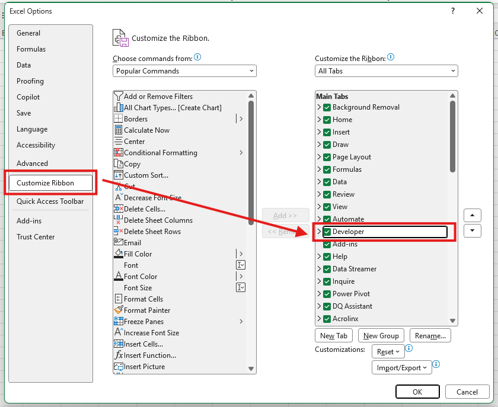
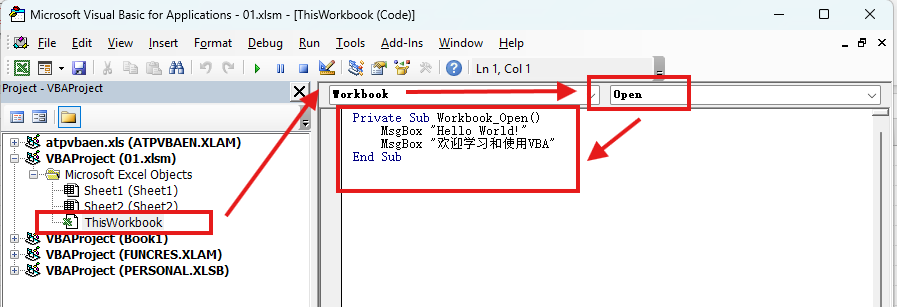
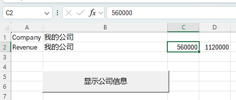
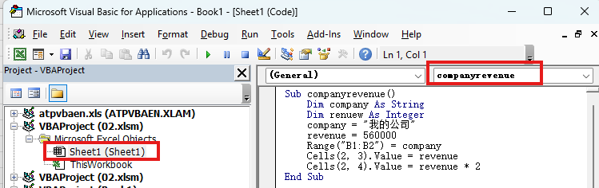
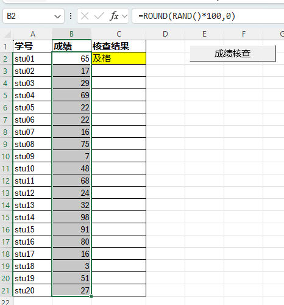
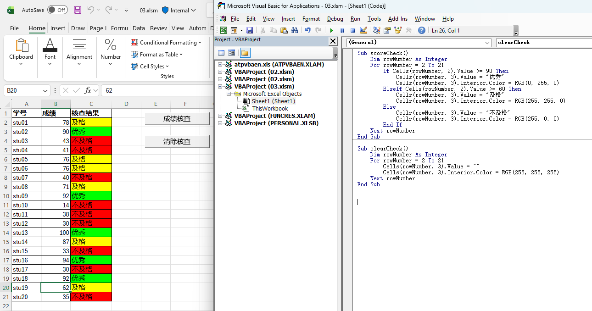
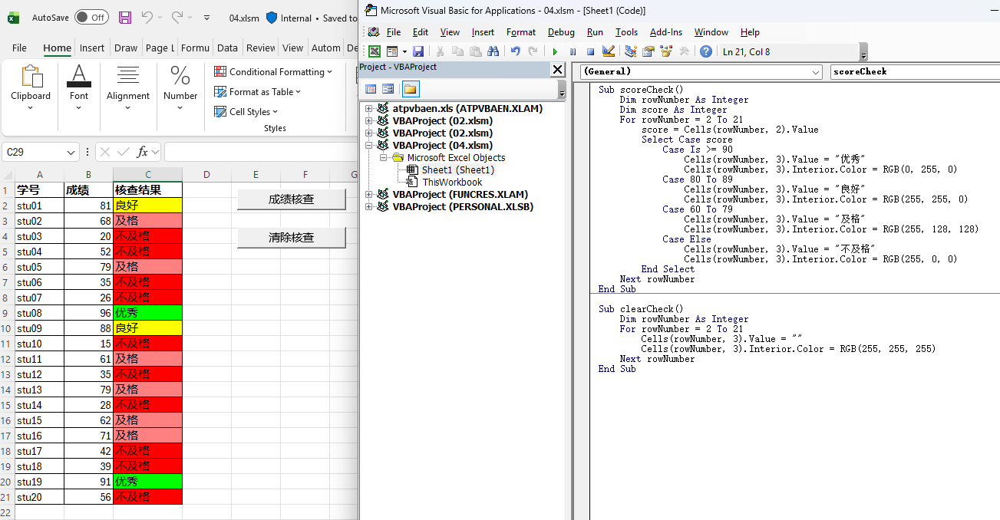
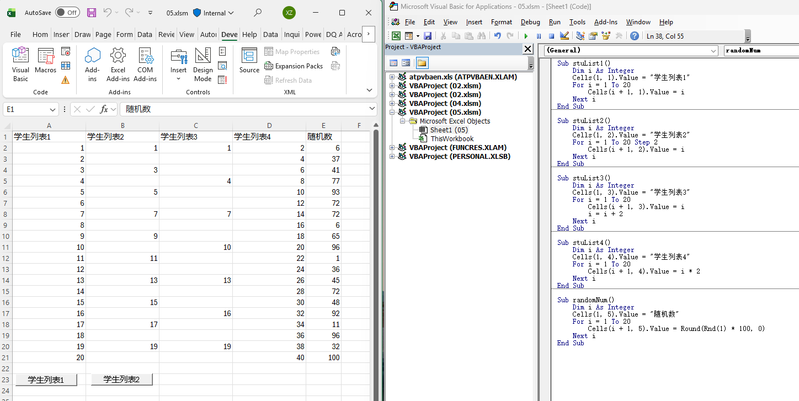
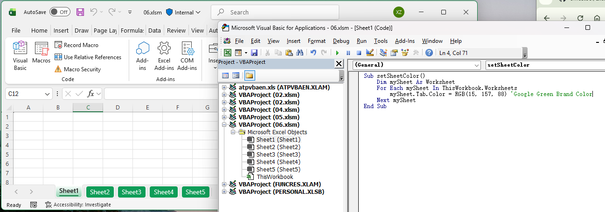
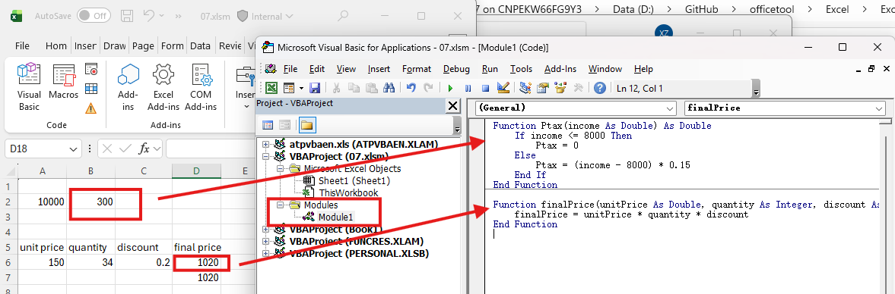

# 10个案例快速上手Excel VBA

- [10个案例快速上手Excel VBA](#10个案例快速上手excel-vba)
  - [例一：第一个VBA程序 - 弹窗](#例一第一个vba程序---弹窗)
  - [例二：变量定义与单元格赋值 - 公司销售信息](#例二变量定义与单元格赋值---公司销售信息)
  - [例三：IF判断 - 成绩判断](#例三if判断---成绩判断)
  - [例四：Select Case - 多路径选择改造“成绩判断”](#例四select-case---多路径选择改造成绩判断)
  - [例五：for循环](#例五for循环)
  - [例六：For Each循环 - 批量管理](#例六for-each循环---批量管理)
  - [例七：自定义函数](#例七自定义函数)
  - [例八：过程调用与程序模块化](#例八过程调用与程序模块化)
  - [例九：使用With语句优化代码](#例九使用with语句优化代码)
  - [例十：整合案例 - 生成节日值班表](#例十整合案例---生成节日值班表)

## 例一：第一个VBA程序 - 弹窗

包含VBA的Excel文件要保存为`*.xlsm`扩展名。

在`Excel Option`>`Customize Ribbon`的右侧点选`Developer`以显示开发者菜单组：



若希望VBA代码能在Excel文件打开时自动运行，可以将代码写入`ThisWorkbook`对象中的`Open`事件中去，如下：



本例中的源代码：

```VB
<!-- Workbook.Open -->
Private Sub Workbook_Open()
    MsgBox "Hello World!"
    MsgBox "欢迎学习和使用VBA"
End Sub
```

## 例二：变量定义与单元格赋值 - 公司销售信息

VBA中变量声名的语法是：`Dim ... As ...`。

引用单元格的方法：
1. `Range("A1")`
2. `Cells(1,1).value`





源代码：

```VB
<!-- Sheet1: (General).companyrevenue -->
Sub companyrevenue()
    Dim company As String
    Dim renuew As Integer
    company = "ÎҵĹ«Ë¾"
    revenue = 560000
    Range("B1:B2") = company
    Cells(2, 3).Value = revenue
    Cells(2, 4).Value = revenue * 2
End Sub
```

## 例三：IF判断 - 成绩判断

使用`=ROUND(RAND()*100,0)`可以产生0到100之间的随机整数。





源代码：

```VB
Sub scoreCheck()
    Dim rowNumber As Integer
    For rowNumber = 2 To 21
        If Cells(rowNumber, 2).Value >= 90 Then
            Cells(rowNumber, 3).Value = "优秀"
            Cells(rowNumber, 3).Interior.Color = RGB(0, 255, 0)
        ElseIf Cells(rowNumber, 2).Value >= 60 Then
            Cells(rowNumber, 3).Value = "及格"
            Cells(rowNumber, 3).Interior.Color = RGB(255, 255, 0)
        Else
            Cells(rowNumber, 3).Value = "不及格"
            Cells(rowNumber, 3).Interior.Color = RGB(255, 0, 0)
        End If
    Next rowNumber
End Sub

Sub clearCheck()
    Dim rowNumber As Integer
    For rowNumber = 2 To 21
        Cells(rowNumber, 3).Value = ""
        Cells(rowNumber, 3).Interior.Color = RGB(255, 255, 255)
    Next rowNumber
End Sub
```

## 例四：Select Case - 多路径选择改造“成绩判断”

语法结构为：

```VB
Select Csae variable
  Case Is condition1
    statement1
  Case condition2
    statement2
  ...
  Case Else
    statement-x
End Select
```



源代码：

```VB
Sub scoreCheck()
    Dim rowNumber As Integer
    Dim score As Integer
    For rowNumber = 2 To 21
        score = Cells(rowNumber, 2).Value
        Select Case score
            Case Is >= 90
                Cells(rowNumber, 3).Value = "优秀"
                Cells(rowNumber, 3).Interior.Color = RGB(0, 255, 0)
            Case 80 To 89
                Cells(rowNumber, 3).Value = "良好"
                Cells(rowNumber, 3).Interior.Color = RGB(255, 255, 0)
            Case 60 To 79
                Cells(rowNumber, 3).Value = "及格"
                Cells(rowNumber, 3).Interior.Color = RGB(255, 128, 128)
            Case Else
                Cells(rowNumber, 3).Value = "不及格"
                Cells(rowNumber, 3).Interior.Color = RGB(255, 0, 0)
        End Select
    Next rowNumber
End Sub

Sub clearCheck()
    Dim rowNumber As Integer
    For rowNumber = 2 To 21
        Cells(rowNumber, 3).Value = ""
        Cells(rowNumber, 3).Interior.Color = RGB(255, 255, 255)
    Next rowNumber
End Sub
```

## 例五：for循环

语法：`For i = 1 to 1000 ... Next i`



源代码：

```VB
Sub stuList1()
    Dim i As Integer
    Cells(1, 1).Value = "学生列表1"
    For i = 1 To 20
        Cells(i + 1, 1).Value = i
    Next i
End Sub

Sub stuList2()
    Dim i As Integer
    Cells(1, 2).Value = "学生列表2"
    For i = 1 To 20 Step 2
        Cells(i + 1, 2).Value = i
    Next i
End Sub

Sub stuList3()
    Dim i As Integer
    Cells(1, 3).Value = "学生列表3"
    For i = 1 To 20
        Cells(i + 1, 3).Value = i
        i = i + 2
    Next i
End Sub

Sub stuList4()
    Dim i As Integer
    Cells(1, 4).Value = "学生列表4"
    For i = 1 To 20
        Cells(i + 1, 4).Value = i * 2
    Next i
End Sub

Sub randomNum()
    Dim i As Integer
    Cells(1, 5).Value = "随机数"
    For i = 1 To 20
        Cells(i + 1, 5).Value = Round(Rnd(1) * 100, 0)
    Next i
End Sub
```

## 例六：For Each循环 - 批量管理

给工作簿里所有工作表的标签统一“上色”。

通过`For Each ... In ...`来遍历集合对象（如本例中的所有工作表）



源代码：

```VB
Sub setSheetColor()
    Dim mySheet As Worksheet
    For Each mySheet In ThisWorkbook.Worksheets
        mySheet.Tab.Color = RGB(15, 157, 88) 'Google Green Brand Color
    Next mySheet
End Sub
```

参考：[Google品牌绿色代码](https://www.colorxs.com/color/google-green)

## 例七：自定义函数

创建计算个人所得税的简易计算器



源代码：

```VB
Function Ptax(income As Double) As Double
    If income <= 8000 Then
        Ptax = 0
    Else
        Ptax = (income - 8000) * 0.15
    End If
End Function

Function finalPrice(unitPrice As Double, quantity As Integer, discount As Double) As Double
    finalPrice = unitPrice * quantity * discount
End Function
```

## 例八：过程调用与程序模块化

建立“日报自动化”的VBA程序，包含如下功能模块：
1. 清空旧数据
2. 导入新数据
3. 计算核心指标
4. 生成可视化图表
5. 发送邮件报告

每个模块通过`Sub`过程完成编程封装，通过总控过程自动化调用。


## 例九：使用With语句优化代码

## 例十：整合案例 - 生成节日值班表